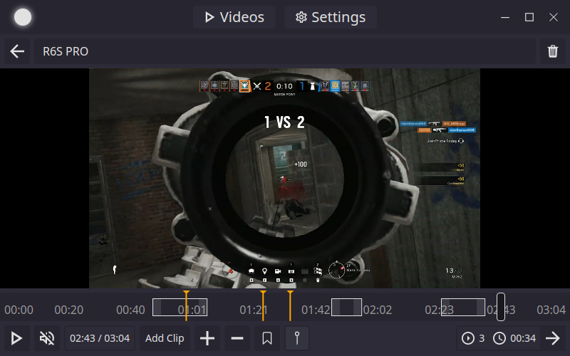
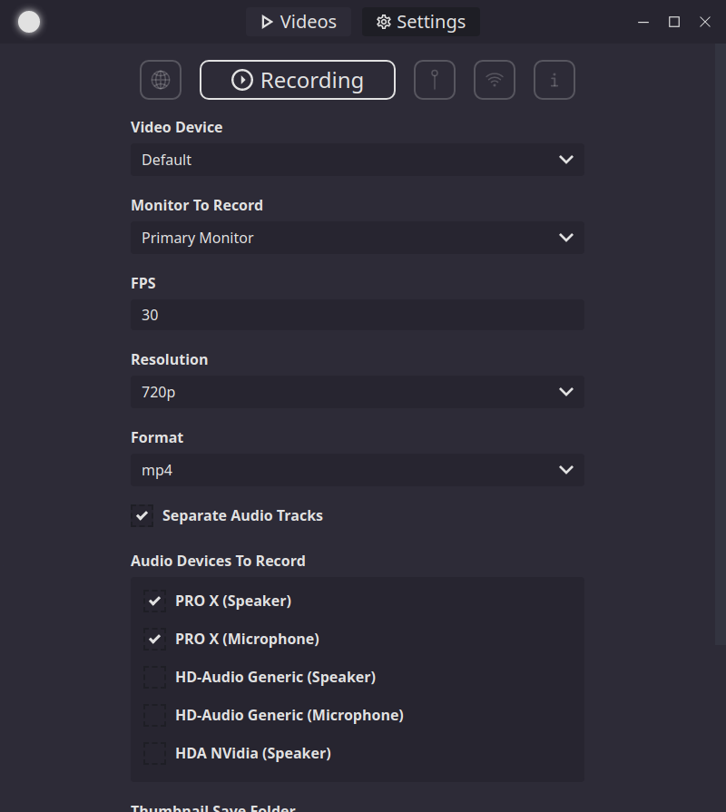

<h1 align="center">Casterr</h1>
<h3 align="center">Recording Since 2020</h3>

  
  
   
   

  

  
  
  
  
  
  
  

  

## The best way to share your moments

Casterr eases the process of sharing your best moments in and out game with our easy to use video clipping system.
[Our website](https://casterr.sbond.co/) provides more detail along with download links for Linux (appimage) and Windows.

Feel free to [test Casterr out](https://github.com/sbondCo/Casterr/releases), [track our progress to the next release](https://github.com/orgs/sbondCo/projects/8/views/2) or [ask for help](https://github.com/sbondCo/Casterr/issues/new/choose)!

## Features & Screenshots

Casterr is capable of performing a lot of duties that can help you when clipping and recording videos.

### Video Recording

Casterr can record your full desktop or a region. There are many settings you can edit to customize your recordings, such as, audio devices to record, separating audio tracks and FPS.

### Past Recording Browser

Search through your past videos and filter by Recordings or Clips. You can import video files (by dragging and dropping them in) from other sources if you don't want to record through Casterr.

### Video Editor

The editor allows you to playback your videos and clip them into highlights.

In this screenshot we are simply playing a video:

Here is an example of adding clips and bookmarks to our video:

When we are done, we can simply click the continue button (right arrow) to create a new video from our clipped sections.

### Customizable Settings (Video, Keybinds, etc)

## Contributing

If you are looking to **contribute** any of your **ideas or code**, look **[here](CONTRIBUTING.md)**.
